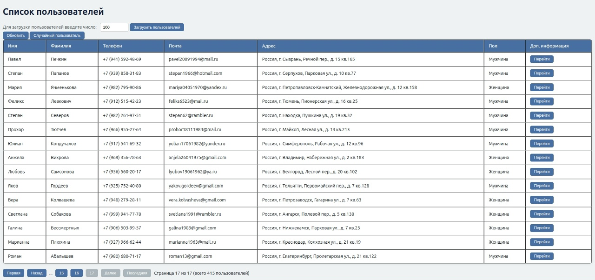
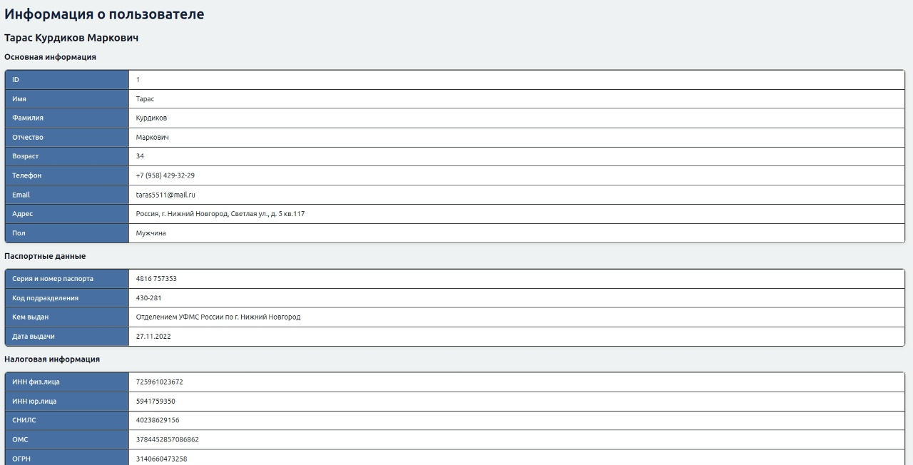
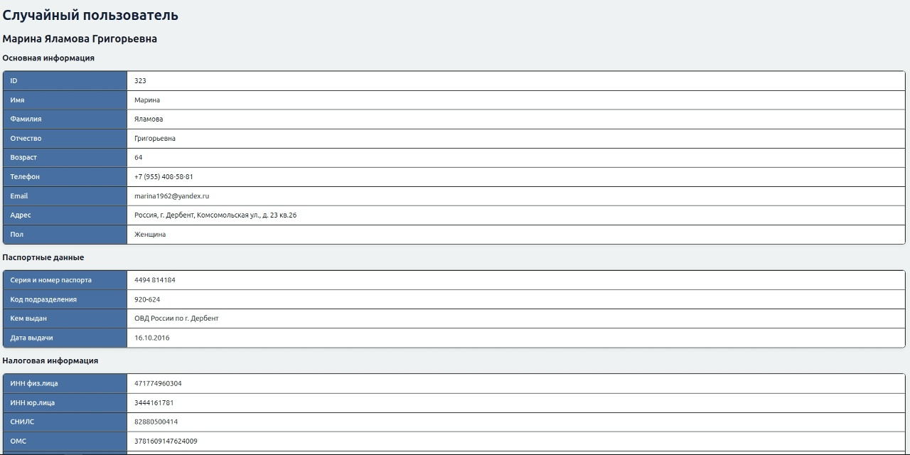
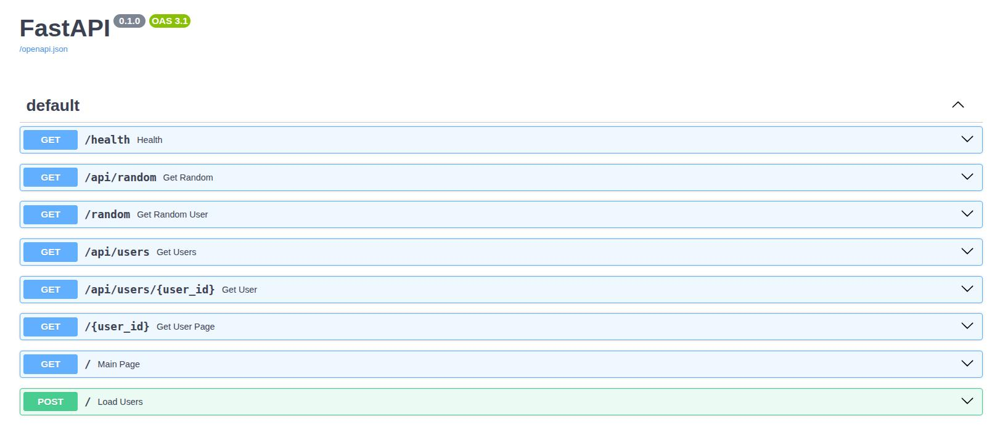
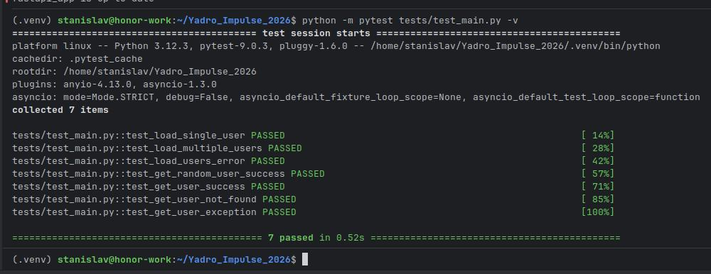

# Yadro Impulse 2026

Целью задания является разработка веб-приложения для взаимодействия с внешним API.

## Технический стек

- FastAPI
- PostgreSQL 17
- SQLAlchemy 2.0
- Pydantic
- asynpg
- HTML/CSS/JS
- Docker/Docker Compose
- pytest

В проекте используется фреймворк FastAPI в связке с 
PostgreSQL + SQLAlchemy + asyncpg, Pydantic для сериализации и валидации, 
Docker + Docker Compose для контейнеризации, HTML + CSS + JS для фронтенда и pytest для тестирования.

Выбор FastAPI обусловлен его высокой скоростью разработки и асинхронностью "из коробки". Он хорошо подходит
для решения данного тестового задания. В данном случае Django замедлил бы скорость разработки из-за долгой 
настройки окружения, а также отстутсвием асинхронности по умолчанию.

PostgreSQL является востребованной и стабильной базой данных с поддержкой ACID транзакцией. Хранение данных
пользователей (особенно банковские и прочие данные) требует надежности, которую может предоставить Postgres.
SQLAlchemy является промышленным стандартом ORM для Python, а asyncpg идеален в связке с Postgres. 

## Локальный запуск

**ВАЖНО**: в проекте не используется файл .env т.к. этот проект является решением тестового задания, поэтому было принято решение НЕ усложнять задачу проверяющему. В реальном проекте стоило бы использовать файл .env с определением настроек базы данных.

Т.к. приложение использует контейнеризацию с помощью Docker и Docker Compose, его можно запустить с помощью команды ниже. (Команду выполнять из корня проекта)
```commandline
docker-compose up -d --build
```
Приложение будет доступно по адресу:
http://localhost:8000

Документация будет доступна по ссылке: http://localhost:8000/docs

## Функциональность

Приложение позволяет выполнять следующие действия:
- Загрузка пользователей из внешнего API. **ВАЖНО**: сайт изменил максимальное количество генераций за один запрос с 1000 до 100, поэтому везде в приложении максимальное число загрузки пользователей - 100.
- Просмотр таблицы всех пользователей. Таблица использует пагинацию по 25 пользователей, с возможностью перехода по страницам (кнопки под таблицей).
- Просмотр полной информации о пользователе. Переход на эту страницу выполняется с помощью кнопки "перейти" в крайнем столбце таблицы.
- Получение случайного пользователя. При обновлении данной страницы будут возвращаться разные пользователи.

Приложение покрыто тестами на каждую функцию, включая краевые случаи (загрузка 1 пользователя, нескольких, ошибка при загрузке и т.д.)

Запуск тестов выполняет по команде:
```commandline
python -m pytest tests/test_main.py -v
```

Перед запуском команды рекомендуется установить библиотеки pytest и pytest-asyncio:
```commandline
pip install pytest pytest-asyncio
```

## Скриншоты приложения

Скриншот главной страницы:


Скриншот страницы пользователя:


Скриншот страницы случайного пользователя:


Скриншот документации:


Скриншот прохождения тестов:

